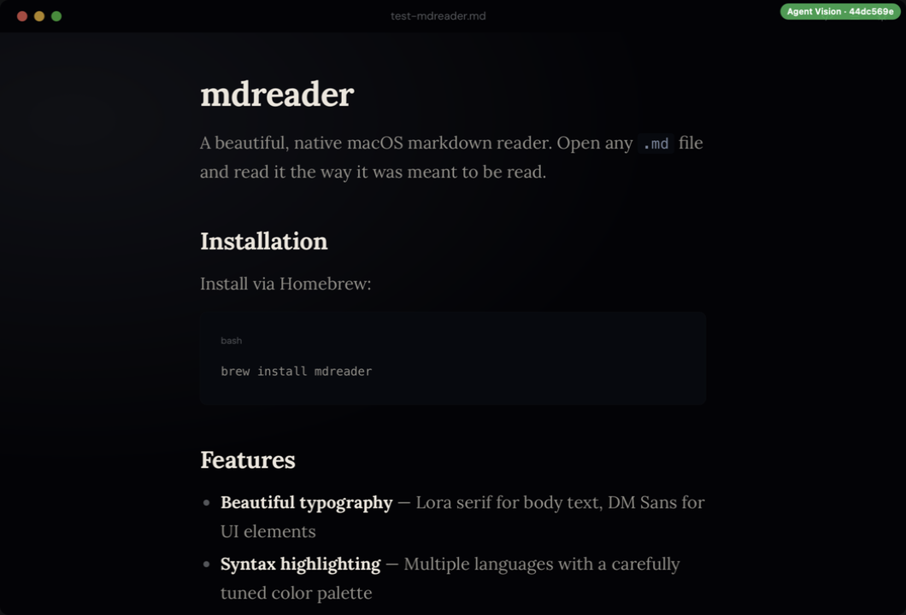

# mdreader

A beautiful, native-feeling macOS markdown reader. Open any `.md` file and read it the way it was meant to be read.



## Why

Every markdown tool on macOS is either an editor that happens to render, or a basic viewer with zero design craft. mdreader is a reader, not an editor. It treats markdown as a first-class reading experience with proper typography, syntax highlighting, and a design that gets out of the way.

## Features

- **Beautiful typography** — Lora serif for body text, DM Sans for UI, IBM Plex Mono for code
- **Syntax highlighting** — powered by highlight.js with a custom color palette
- **Dark, light, and system themes** — persisted across sessions
- **Floating glassy sidebar** — file tree with Phosphor icons, collapsible with `Cmd+\`
- **Table of contents** — auto-generated from headings, scroll tracking, toggle with `Cmd+Shift+O`
- **Folder browsing** — open a directory and browse all markdown files
- **Live reload** — file changes on disk are reflected instantly
- **Drag and drop** — drop any `.md` file onto the window
- **GFM support** — tables, task lists, strikethrough, autolinks

## Install

### Homebrew (recommended)

```bash
brew tap rvanbaalen/mdreader
brew install --cask mdreader
```

### Download

Grab the latest `.zip` from [GitHub Releases](https://github.com/rvanbaalen/mdreader/releases), extract it, and move `mdreader.app` to your Applications folder.

## Usage

Open the app and use `Cmd+O` to open a file, or `Cmd+Shift+O` to open a folder.

From the terminal:

```bash
# Open a file
open -a mdreader README.md

# Open a folder
open -a mdreader ./docs
```

## Keyboard Shortcuts

| Action | Shortcut |
|--------|----------|
| Open file | `Cmd+O` |
| Open folder | `Cmd+Shift+O` |
| Toggle sidebar | `Cmd+\` |
| Toggle table of contents | `Cmd+Shift+O` |
| Toggle theme | `Cmd+Shift+T` |

## Design

The design system is adapted from [robinvanbaalen.nl](https://robinvanbaalen.nl). Dark theme by default. Cool slate accent. Editorial serif typography. Glassy translucent panels. Subtle topographic background pattern. Everything transitions smoothly, nothing snaps.

## Development

```bash
git clone https://github.com/rvanbaalen/mdreader.git
cd mdreader
npm install
npm start
```

To open a file directly:

```bash
npm start -- /path/to/file.md
```

## Building

```bash
npm run dist:zip
```

Creates a universal `.zip` in `dist/`. No code signing required.

## License

MIT
